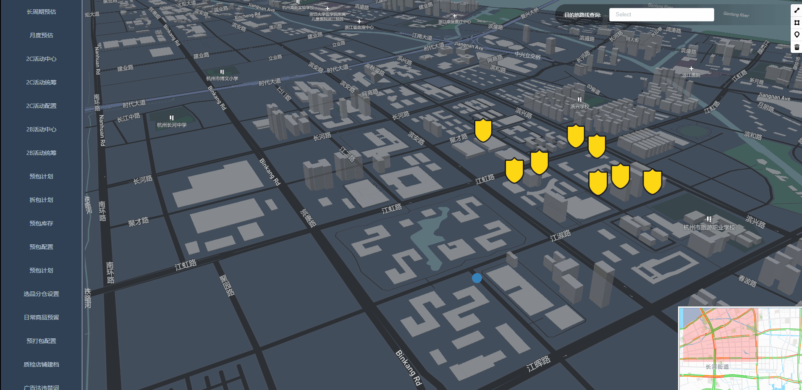

这是一个vite项目，主要用于练习ts+vue3。vite启动一个字，就是快。

### 基本配置

使用jsx需要用到`@vitejs/plugin-vue-jsx`这个插件，ts是天然支持jsx的，在使用composition-api和jsx写组件的时候感觉跟react没啥区别。配置`eslint`、`stylelint`、`prettier`，这些代码规范的工程化配置感兴趣可以去看源码。

### 需求场景

该项目加载一张`mapbox`的地图，根据其给的api做了几个需求，主要是地图路线导航和地点正反向搜索。

固定地图初始位置，点击地图任意一点可以导出一条路径：



输入框输入关键词选择后以该点导出一条路径：


### 接口封装

vue3的请求接口将其封装以hook的形式封装到`composition` 文件夹下

```ts
import axios, { AxiosRequestConfig } from "axios"
import { reactive, toRefs, watch } from "vue"

const baseURL = "/api"

const http = axios.create({
  withCredentials: true,
  //@ts-ignore
  crossDomain: true,
  baseURL: baseURL,
  timeout: 1000 * 60
})

export default (getConfig: () => AxiosRequestConfig) => {
  const state = reactive({
    data: null,
    loading: false
  })
  const config: AxiosRequestConfig = reactive(getConfig?.() || {})
  watch(getConfig, (val) => {
    Object.assign(config, {...val})
  })
  const run = async (customConfig?: AxiosRequestConfig) => {
    state.loading = true
    const res = await http({
      method: config.method ?? "get",
      url: config.url,
      [["get", "GET"].indexOf(config.method ?? "") > -1 ? "params" : "data"]:
        config.data,
      ...customConfig
    })
    state.loading = false
    state.data = res.data
  }
  return {
    ...toRefs(state),
    run
  }
}


```

封装的比较简陋，实际使用和直接用`axios`没啥区别，但也是场景比较简单的缘故，不作太多过度封装使用起来比较轻便，其中有意思的地方在于请求的过程中数据响应式化。

这里每次请求需要都是通过`run`函数手动去调，请求参数可以在初始的时候将所有参数通过回调传入

```ts
const { data, run } = useRequset(() => ({
    url: "yourUrl",
    params:{
        geometries: "geojson",
        access_token: token,
        steps: true
    }
}))

```


也可以在`run` 调用时传递参数,`run`的参数可以覆盖初始的参数，使用哪种方式传参主要取决所需的参数在何时得到。

```ts
const getRoute = async (end: [number, number], map: any) => {
    await run({
        url: `${api.map.route}${start[0]},${start[1]};${end[0]},${end[1]}`,
        params:{
            geometries: "geojson",
            access_token: token,
            steps: true
        }}
   )}
	if(data.value.code === 'Ok') {
        // do something...
    }
}
```

### vue3中的tsx

和模板语法相比变动的地方：

·1、`v-if` `v-for`指令需要使用`js`去渲染

2、事件注册或者自定义`emit`事件，比如`@customEvent` 在`tsx`中改为`onCustomEvent`的形式

3、`slot` 通过`v-slots`接收一个对象，对象存放对应的渲染函数，子组件通过调用这些函数完成渲染逻辑，类似`render props`

```tsx
const Child = defineComponent({
  setup(props, context) {
    return () => (
      <div>
        {context.slots.default?.()}
      </div>
    )
  }
})

const Parent = defineComponent({
  setup(props, context) {
    return () => (
      <Child v-slots={{default: () => '我是default'}}></Child>
    )
  }
})
```


### 问题

最新的element-plus版本的在vite中会出现`requir is not defined`报错，这个问题我是通过降级版本解决的。

